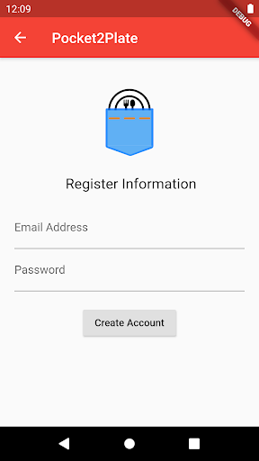
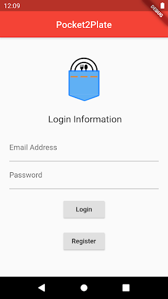
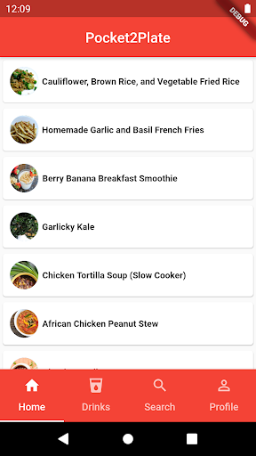
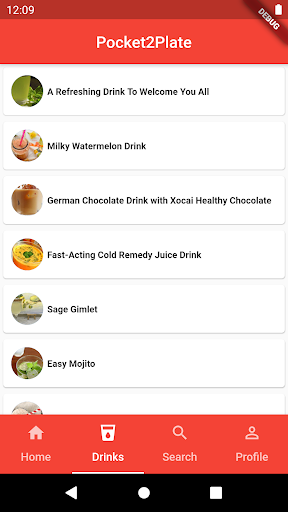
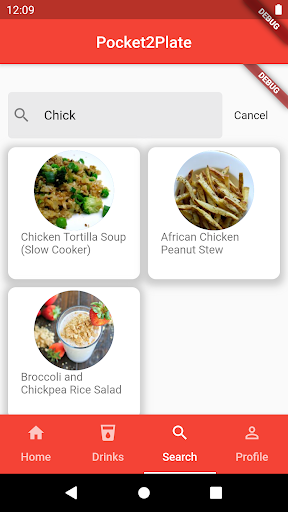

# Pocket2Plate

Students and young adults often have difficulties in finding what to make based on different ingredients they have. This application called Pocket2Plate aims to help people discover various recipes they can make based on stand-alone ingredients they have already. The app allows users to input their ingredients and we provide them with delicious food and drink recipes that best fit their inputs and preferences. The user can also search for a recipe based on certain ingredients with their own custom account. 

## Overview

The frontend of the app uses the flutter sdk. When the user starts interacting with the app,they’ll be presented with a welcoming login/sign up page. The app layout lets you scroll between the home, drinks, search, and profile pages with ease, and press on the presented recipes for more information. The main component of the frontend is the search engine, which allows users to input food queries. It processes the input to present recipe names from the API that include the query string. For example, if you input the word “Chick,” as seen in the slide, the app will present possible recipes such as chicken tortilla soup, african chicken peanut stew, and broccoli and chickpea rice salad. If the user inputs a string that is not contained in the provided recipes, the search engine will not return anything.

For the backend, the app utlizes Firebase for loging in and user authentication. This will allow the user to create a profile with their own custom settings and password, many of which will be stored in the database. The backend also involves utilizing an API, the Spoonacular API to generate recipes based on the ingredients the user inputs, and using additional queries to take into account any other dietary preferences they might have (such as allergies, vegetarian or vegan, etc). The Spoonacular API provides built-in functions to search for over 5000 recipes using their ingredients, nutrients, their ID, or simply returning random recipes. For the app, we are implementing the ComplexSearch function as this allows the app to combine searching by query and ingredients into a single endpoint. 

## Walkthrough 

Start by creating an account and once done login. Once you enter the app, there are all the food recipes, which are being displayed with the title and a photo. Let’s say you're interested in the recipe for Garlicky kale, you just click it and it provides you with more details. There is also a tab for all the drinks, which is shown. There is also a search bar where you can search for specific recipes or indregedenits and it will find you an assortment of recipes. Finally once you have finished using the recipe you can go to the profile tab and logout.

## Images 

